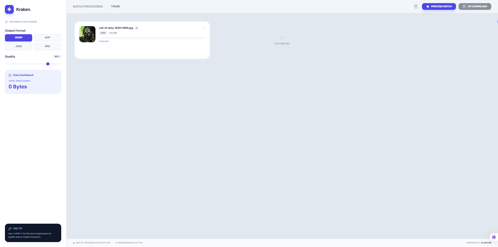
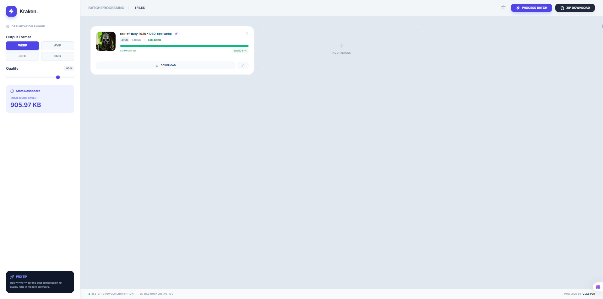

# kraken

Optimiza y convierte imágenes directamente en el navegador (batch), con redimensionado, métricas de ahorro y descarga en ZIP. Incluye renombrado sugerido por IA (opcional) vía endpoint serverless para mantener tu API key fuera del frontend.

[https://github.com/glastor-dev/kraken](https://github.com/glastor-dev/kraken)

## Capturas

## Features

- Procesamiento en lote (batch) con estado por archivo y descarga en ZIP.
- Conversión de formato (p. ej. WebP/AVIF/JPEG/PNG) y control de calidad.
- Redimensionado previo para respetar `maxWidth` / `maxHeight`.
- Vista previa y métricas de ahorro (tamaño original vs optimizado).
- Renombrado sugerido por IA (opcional) vía `/api/suggest-name`.

## Stack

- Vite + React + TypeScript
- `browser-image-compression` + `JSZip`
- Vercel Functions (`/api/*`) para IA con Gemini (`@google/genai`)

## Requisitos

- Node.js 20+

## Uso local

1. Instalar dependencias:
   - `npm install`
2. Copiar `.env.example` a `.env.local` y completar tu clave (solo para dev / funciones serverless):
   - `GEMINI_API_KEY=...`
3. Ejecutar en desarrollo:
   - `npm run dev`

## Deploy en Vercel

- El proyecto está preparado como SPA + Functions.
- Configura `GEMINI_API_KEY` como variable de entorno en Vercel.
- Luego despliega normalmente desde el repo.

## Scripts

- `npm run dev` — desarrollo
- `npm run build` — build de producción
- `npm run preview` — preview del build

## Seguridad

- No coloques `GEMINI_API_KEY` en el frontend.
- El renombrado IA se resuelve en el servidor vía `/api/suggest-name`.

## Contribuir

Lee [CONTRIBUTING.md](CONTRIBUTING.md). Reportes y sugerencias en [Issues](https://github.com/glastor-dev/kraken/issues).

## Licencia

Ver [LICENSE](LICENSE).
